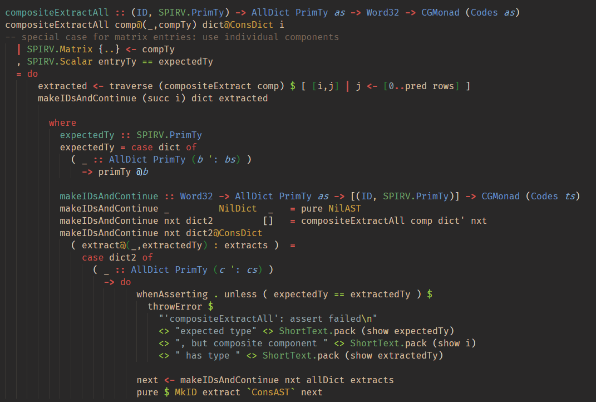

# Groovy Lambda

<p align="center">
  <a href="https://marketplace.visualstudio.com/items?itemName=sheaf.groovylambda">
    
  </a>
</p>

__Groovy Lambda__ is a simple VS Code color theme optimised for __Haskell__, based on [__Gruvbox Material Dark__](https://github.com/sainnhe/gruvbox-material-vscode).

Supports the TextMate scopes provided by the [__Language Haskell__](https://github.com/JustusAdam/language-haskell) VS Code extension:

  * disambiguates between data constructors and types in data declarations,
  * visually clear appearance of qualified names,
  * distinguishes different uses of @: type application, record syntax or infix operator,
  * special highlighting for record fields,
  * highlights MagicHash and OverloadedLabels,
  * underlines recognised GHC language extensions.

<p align="center">
  
</p>

# Installation

The theme can be installed directly from VS Code: search for `Groovy Lambda` in the extensions, and install.    
See also the its [VS Code marketplace page](https://marketplace.visualstudio.com/items?itemName=sheaf.groovylambda).

# Customisation

To change how something is highlighted, proceed as follows:

  * While browsing code containing highlighting you'd like to change, start the TextMate scope inspector as follows:
    - open the VS Code Command Palette (Ctrl+Shift+P),
    - start typing "Inspect Editor Tokens and Scopes" and select this item from the dropdown menu.
  * Click on the code whose highlighting you'd like to change; this will display the TextMate scopes associated to that piece of code. For instance, `if` in a Haskell source file is given the scope `keyword.control.if.haskell`.
  * Open your `settings.json` file:
    - open the VS Code Command Palette (Ctrl+Shift+P),
    - start typing "Open Settings (JSON)" and select this item from the dropdown menu.
  * Make the modifications by editing the value of `editor.tokenColorCustomizations` in your settings.
    For instance, to highlight `if` and `then` in red and `else` in blue, one would write:

```json
    "editor.tokenColorCustomizations": {
      "textMateRules": [
        {
          "scope": [ "keyword.control.if", "keyword.control.then" ],
          "settings": {
            "foreground": "#ff0000"
          }
        },
        {
          "scope": "keyword.control.else",
          "settings": {
            "foreground": "#0000ff"
          }
        }
      ]
    }
```
